## Part 7. **Prometheus** и **Grafana**

### 7.1. **Prometheus**

Скачиваем последнюю версию Prometheus с github.com/prometheus/prometheus/releases

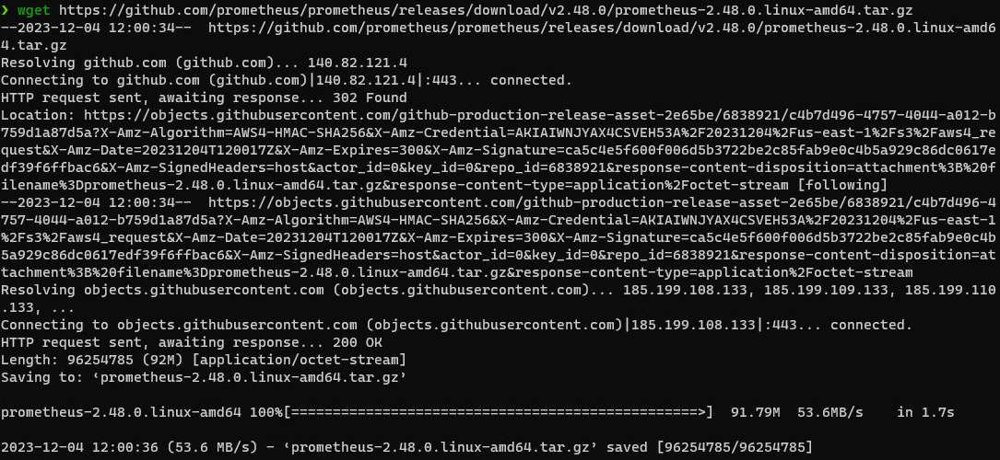(prometheus_download)

Распаковываем архив:

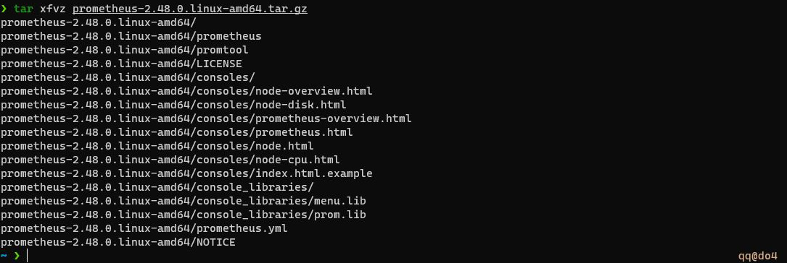(prometheus_unpack)

Копируем распакованные файлы на устройство:

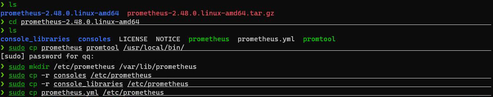(prometheus_copy)

Создаём системного пользователя prometheus без домашней папки и без логина, и меняем владельца файлов на него:

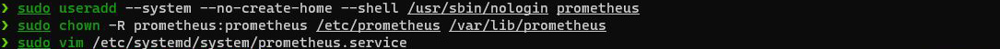(prometheus_user)

Поскольку, мы будем использовать **systemd**, то создаём файл конфигурации **prometheus.service** в директории **/etc/systemd/system**:

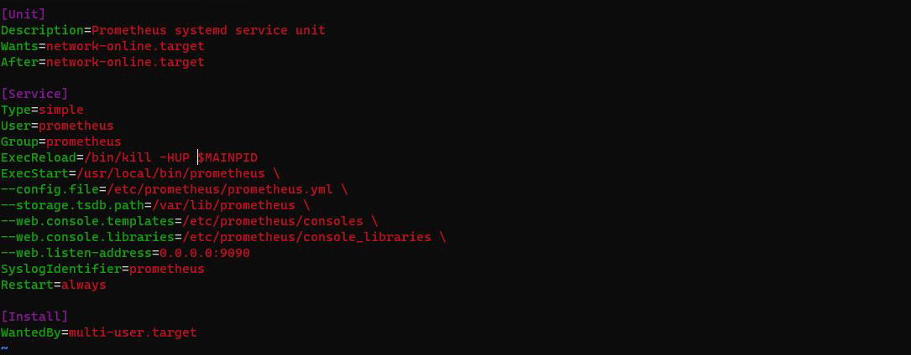(prometheus_service)

Теперь можно запустить **Prometheus**:

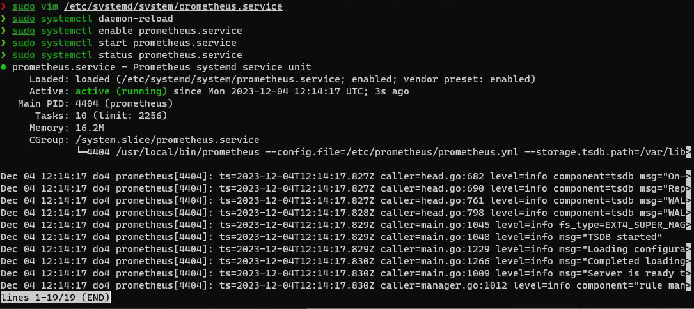(prometheus_start)

Проверяем, что **Prometheus** запустился:

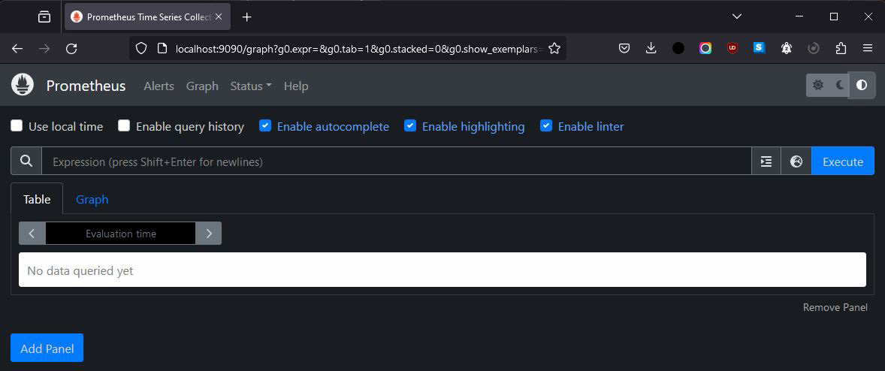(prometheus_check)

### 7.2. **Node exporter**

Скачиваем последнюю версию Node exporter с github.com/prometheus/node_exporter/releases

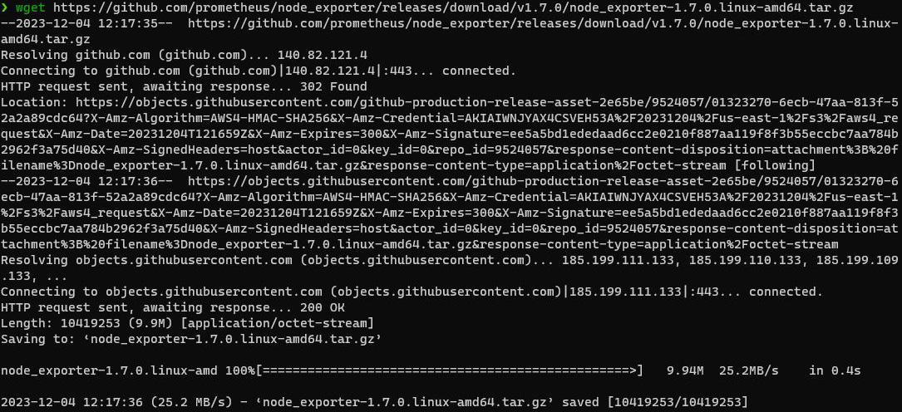(node_exporter_download)

Распаковываем архив:

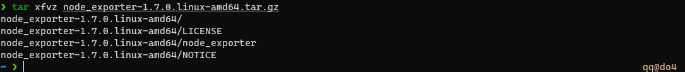(node_exporter_unpack)

Копируем распакованные файлы на устройство:

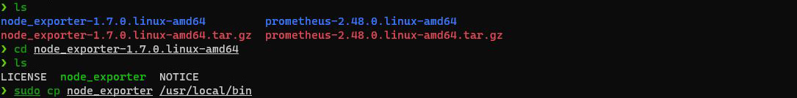(node_exporter_copy)

Создаём системного пользователя node_exporter без домашней папки и без логина, и меняем владельца файлов на него:

(node_exporter_user)

Поскольку, мы будем использовать **systemd**, то создаём файл конфигурации **node_exporter.service** в директории **/etc/systemd/system**:

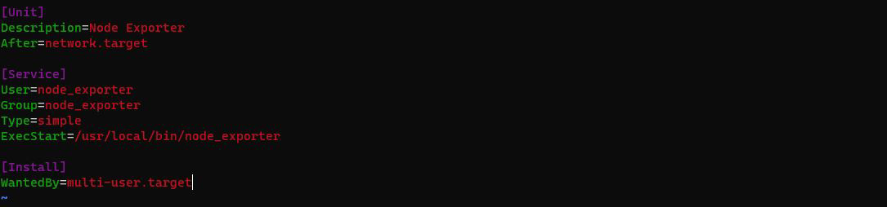(node_exporter_service)

Теперь можно запустить **Node exporter**:

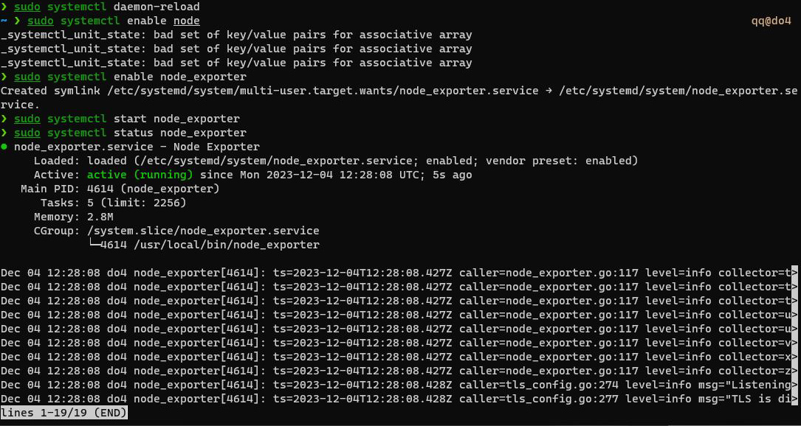(node_exporter_start)

Необходимо создать статическую цель **Node exporter** в конфигурационном файле **prometheus.yml**:

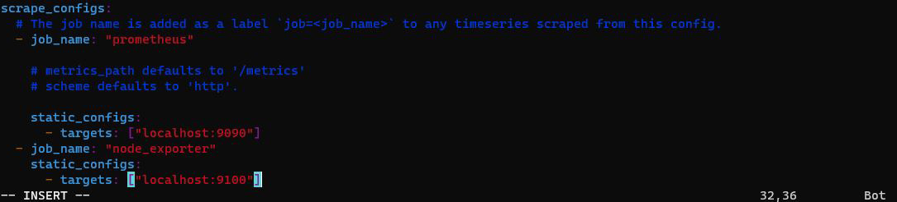(prometheus_config)

Теперь цели отображаются в веб-интерфейсе **Prometheus**:

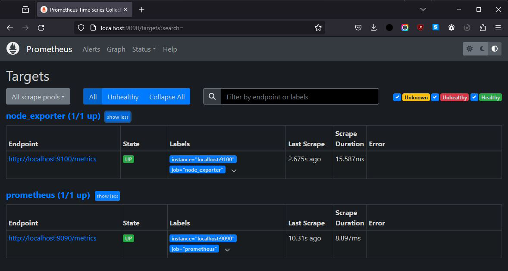(prometheus_targets)

### 7.3. **Grafana**

Устанавливаем **Grafana** по инструкции с официального сайта. Устанавливаем необходимые пакеты:

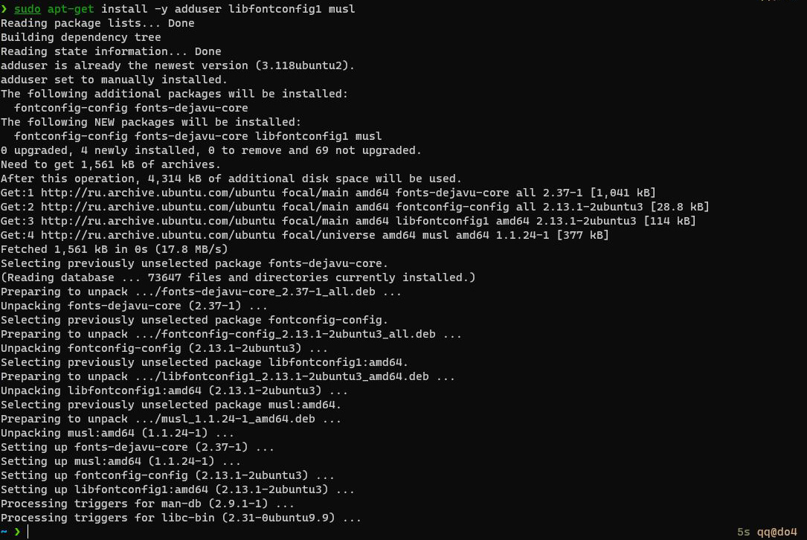(grafana_install)

Скачиваем последнюю версию и устанавливаем **Grafana**:

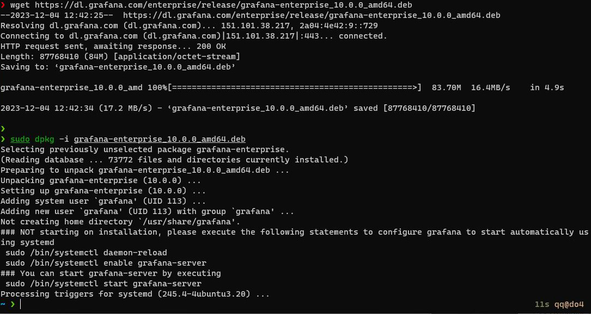(grafana_download)

Запускаем **Grafana**:

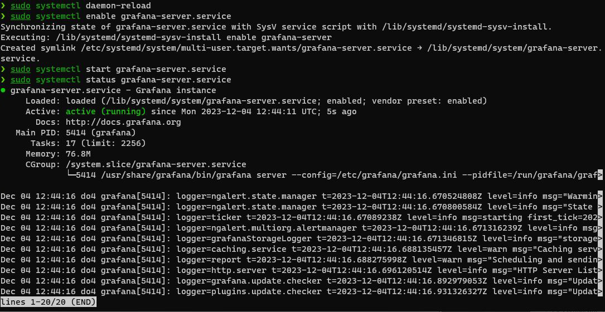(grafana_start)

Подключаемся к веб-интерфейсу **Grafana** и создаём дашборд с нужными метриками - **CPU**, **Memory**, **Disk**:

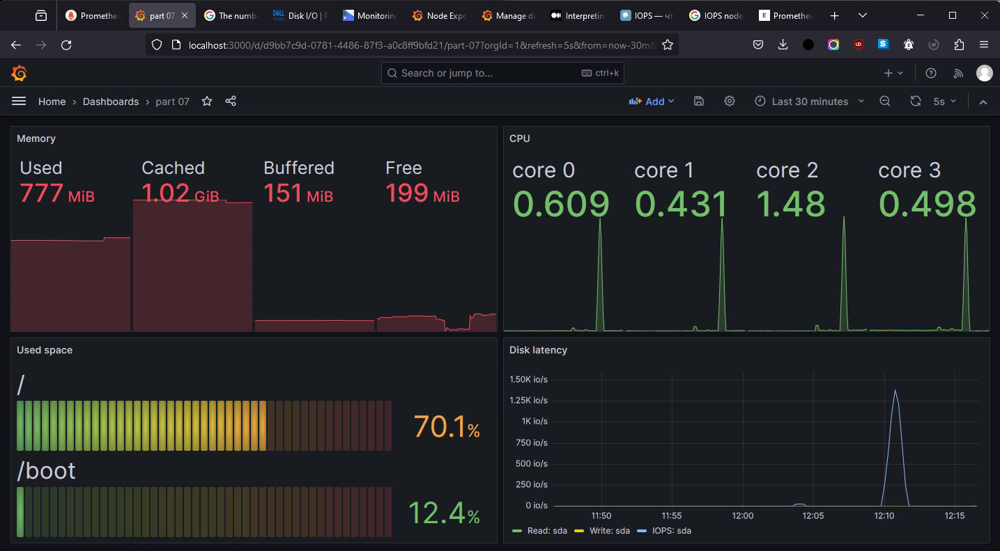(grafana_dashboard)

Запускаем скрипт из второй части, отмечаем изменение метрик в **Grafana**:

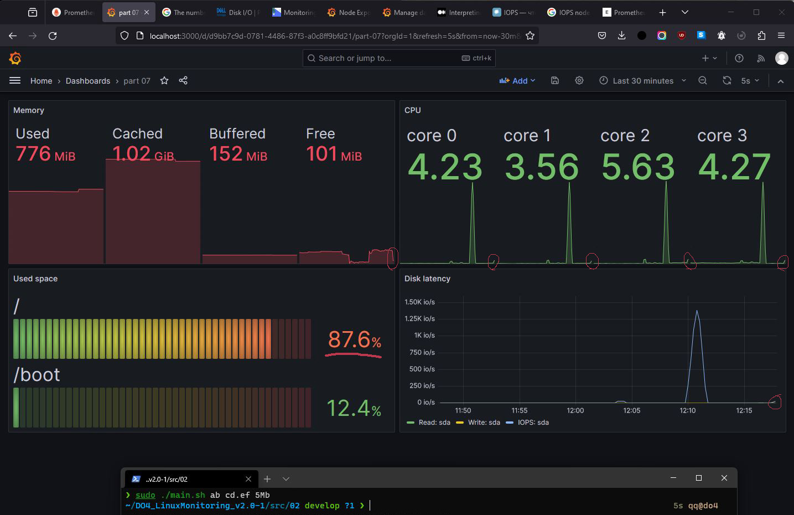(script_start)

Установливаем утилиту **stress** и запускаем команду `stress -c 2 -i 1 -m 1 --vm-bytes 32M -t 60s`. Здесь стоит **60s** для более яркой иллюстрации. Отмечаем изменение метрик в **Grafana**:

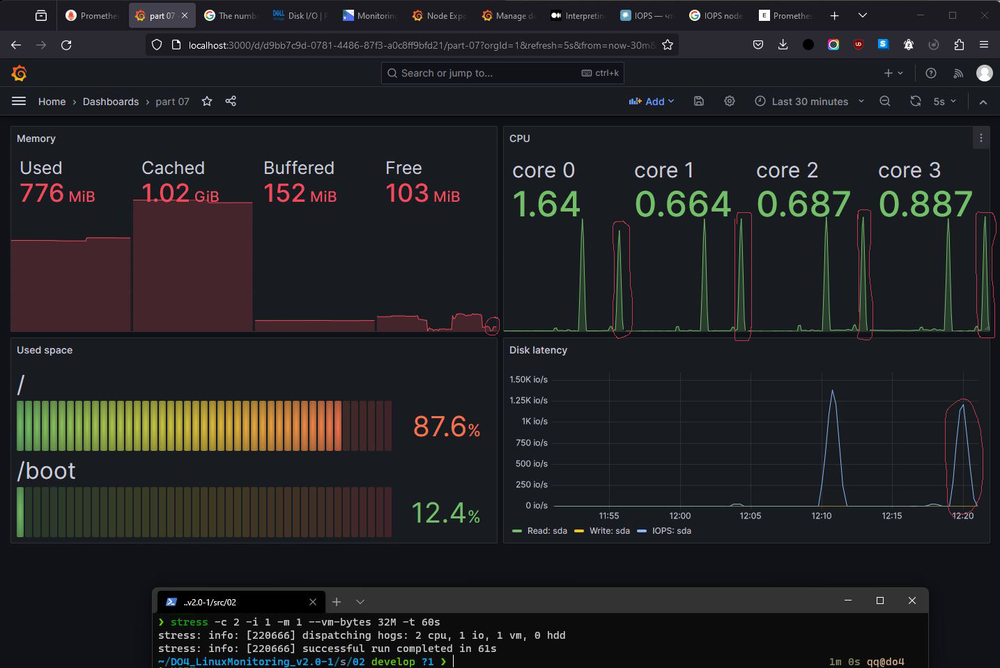(stress_start)