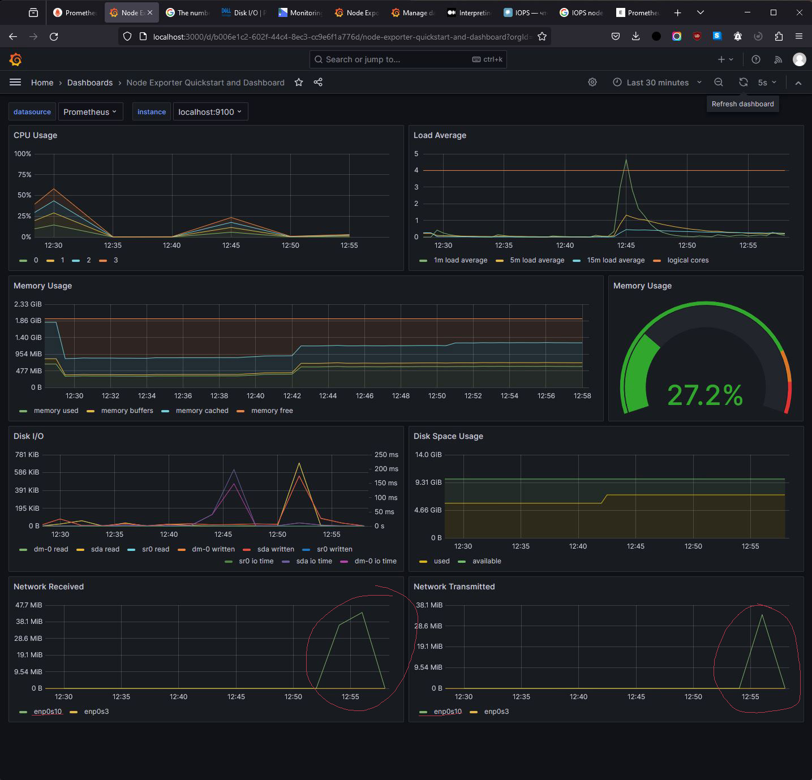

## Part 8. Готовый дашборд

Импортируем готовый дашборд *Node Exporter Quickstart and Dashboard* с официального сайта **Grafana Labs** и проводим те же тесты, что и в предыдущей части.

Запускаем скрипт из второй части:

(script_start)

Запускаем `stress -c 2 -i 1 -m 1 --vm-bytes 32M -t 60s`:
    
(stress_start)

Запускаем ещё одну машину в одной локальной сети с текущей и запускаем утилиту **iperf3** используя поочерёдно каждую машину в качестве сервера и клиента. Отмечаем изменение метрик в **Grafana**:

(iperf_start)